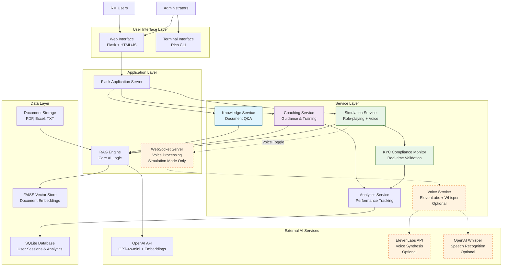
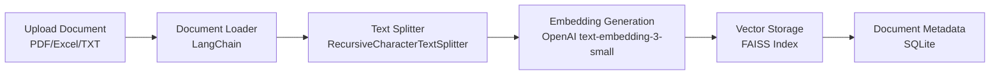

# UOB RM AI Assistant - System Architecture

## 🎯 **System Overview**

The UOB RM AI Assistant is a comprehensive AI-powered training platform designed to enhance Relationship Manager (RM) skills through intelligent knowledge access, coaching, and realistic simulation experiences. The system combines Retrieval-Augmented Generation (RAG) technology with advanced voice processing and real-time compliance monitoring.

## 🏗️ **High-Level Architecture**



## 📋 **Component Architecture**

### **1. Core Components**

#### **RAG Engine** (`src/core/rag_system.py`)
```python
class RAGSystem:
    """
    Core RAG implementation with:
    - Document ingestion (PDF, Excel, TXT)
    - Vector embeddings (OpenAI text-embedding-3-small)
    - Semantic search (FAISS)
    - LLM integration (GPT-4o-mini)
    - Query optimization and caching
    """
```

#### **Voice Service** (`src/services/voice_service.py`) - *Optional Enhancement*
```python
class VoiceService:
    """
    Optional voice enhancement for simulation mode:
    - Speech-to-Text (OpenAI Whisper)
    - Text-to-Speech (ElevenLabs)
    - WebSocket communication
    - Audio stream processing
    - Integrated with existing text simulation
    """
```

#### **KYC Compliance Monitor** (`src/services/kyc_monitor.py`)
```python
class KYCComplianceMonitor:
    """
    Real-time compliance validation:
    - KYC checklist tracking
    - Conversation analysis
    - Compliance scoring
    - Violation detection
    """
```

### **2. Interface Components**

#### **Web Interface** (`src/interfaces/web/`)
```
├── app.py              # Flask application
├── templates/          # Jinja2 templates
│   ├── index.html      # Main dashboard
│   ├── knowledge.html  # Knowledge mode
│   ├── coaching.html   # Coaching mode
│   └── simulation.html # Simulation mode
└── static/
    ├── css/styles.css  # Styling
    └── js/
        ├── main.js     # Common functionality
        ├── knowledge.js# Knowledge mode logic
        ├── coaching.js # Coaching mode logic
        └── simulation.js# Simulation mode logic
```

#### **Terminal Interface** (`src/interfaces/terminal/main.py`)
- Rich CLI interface
- Command-line operations
- Administrative functions

## 🔄 **Data Flow Architecture**

### **Document Processing Flow**


## 📋 **Mode-Specific Data Flows**

### **1. 📚 Knowledge Mode Flow**


```mermaid
graph LR
    A[User Question] --> B[Knowledge Service<br/>Query Processing]
    B --> C[Intent Classification<br/>Insurance vs General]
    C --> D[RAG Engine<br/>Document Retrieval]
    D --> E[Vector Search<br/>FAISS Similarity]
    E --> F[Context Retrieval<br/>Top-K Documents]
    F --> G[Prompt Engineering<br/>Insurance Context]
    G --> H[LLM Generation<br/>GPT-4o-mini]
    H --> I[Response Formatting<br/>With Sources]
    I --> J[Cache Storage<br/>Query Results]
    J --> K[Return Answer<br/>+ Source Citations]
```

### **2. 🎯 Coaching Mode Flow**

```mermaid
graph LR
    A[User Coaching Request] --> B[Coaching Service<br/>Scenario Analysis]
    B --> C[Intent Detection<br/>Product/Sales/Communication]
    C --> D[Historical Analysis<br/>Past Coaching Sessions]
    D --> E[RAG Engine<br/>Retrieve Best Practices]
    E --> F[Context Enhancement<br/>User Experience Level]
    F --> G[Personalized Guidance<br/>LLM Generation]
    G --> H[Practice Exercises<br/>Dynamic Generation]
    H --> I[Analytics Storage<br/>Coaching Effectiveness]
    I --> J[Return Guidance<br/>+ Practice Suggestions]
```


### **3. 🎮 Simulation Mode Flow with Real-Time KYC Validation**
```mermaid
graph TD
    A[Start Simulation] --> B[Simulation Service<br/>Scenario Setup]
    B --> C[Customer Profile<br/>Generation]
    C --> D[KYC Monitor<br/>Initialize Checklist<br/>🔴 Step 1: Pending]

    D --> E[Text Conversation<br/>Default Mode]
    D --> F[Voice Toggle Available<br/>Optional Enhancement]

    E --> G[RM Input<br/>Text Response]
    F --> H[Voice Input<br/>Speech-to-Text]

    G --> I[Process Response]
    H --> I

    I --> J[Real-Time KYC Validation<br/>⚡ Live Compliance Check]
    J --> K{Validation Result}

    K -->|✅ PASSED| L[Generate AI Customer Response]
    K -->|⚠️ NEEDS MORE INFO| M[Generate Customer Objection<br/>"I need more details..."]
    K -->|❌ VIOLATION| N[Generate Compliance Warning<br/>"Please follow KYC procedure"]

    L --> O{Output Mode}
    M --> O
    N --> O

    O --> P[Text Display<br/>Standard UI]
    O --> Q[Text-to-Speech<br/>ElevenLabs Synthesis]

    Q --> R[Audio Playback<br/>+ Text Display]
    P --> S[RM Response Input<br/>Continue Loop]
    R --> S

    J --> T[Update KYC Progress<br/>🔴🟡🟢 Step Status]
    T --> S

    S --> U{Continue?}
    U -->|Yes| G
    U -->|No| V[End Simulation]

    V --> W[Final KYC Score<br/>Compliance Percentage]
    W --> X[Performance Report<br/>KYC Violations + Recommendations]
```

## ⚡ **Real-Time KYC Validation System**

### **KYC Checklist Framework**

#### **Insurance KYC Steps (UOB Standards)**
```python
KYC_CHECKLIST = {
    "step_1": {
        "name": "Customer Identification",
        "required_info": ["full_name", "contact_number", "email"],
        "validation_rules": [
            "Must ask for full name within first 2 exchanges",
            "Must verify contact information",
            "Must confirm identity through conversation"
        ],
        "compliance_score": 25
    },
    "step_2": {
        "name": "Financial Information Gathering",
        "required_info": ["occupation", "income_level", "dependents"],
        "validation_rules": [
            "Must inquire about employment status",
            "Must ask about monthly income range",
            "Must identify family structure",
            "Must assess financial stability"
        ],
        "compliance_score": 25
    },
    "step_3": {
        "name": "Insurance Needs Assessment",
        "required_info": ["coverage_type", "sum_assured", "premium_budget"],
        "validation_rules": [
            "Must explore protection needs",
            "Must discuss coverage amounts",
            "Must align with customer's budget",
            "Must explain product benefits"
        ],
        "compliance_score": 25
    },
    "step_4": {
        "name": "Risk Profiling & Compliance",
        "required_info": ["risk_tolerance", "investment_preference"],
        "validation_rules": [
            "Must assess risk tolerance level",
            "Must comply with suitability rules",
            "Must document all disclosures",
            "Must follow anti-money laundering procedures"
        ],
        "compliance_score": 25
    }
}
```

### **Real-Time Validation Engine**

#### **Validation Triggers**
```python
class RealTimeKYCValidator:
    """
    Real-time KYC compliance monitoring during simulation
    """

    def __init__(self, session_id: str):
        self.session_id = session_id
        self.checklist_status = {
            "step_1": {"status": "pending", "completed": False, "score": 0},
            "step_2": {"status": "pending", "completed": False, "score": 0},
            "step_3": {"status": "pending", "completed": False, "score": 0},
            "step_4": {"status": "pending", "completed": False, "score": 0}
        }
        self.conversation_history = []
        self.violations = []

    def validate_turn(self, rm_message: str, customer_response: str) -> dict:
        """
        Validate each conversation turn in real-time
        """
        self.conversation_history.append({
            "rm_message": rm_message,
            "customer_response": customer_response,
            "timestamp": datetime.now()
        })

        validation_result = {
            "passed": True,
            "feedback": [],
            "next_action": "continue",
            "checklist_updates": [],
            "violations": []
        }

        # Step 1: Customer Identification Validation
        if self.checklist_status["step_1"]["status"] == "pending":
            step1_validation = self._validate_step1(rm_message)
            if step1_validation["passed"]:
                self.checklist_status["step_1"]["status"] = "completed"
                self.checklist_status["step_1"]["score"] = 25
                validation_result["checklist_updates"].append("step_1")
            elif step1_validation["warning"]:
                validation_result["feedback"].append(step1_validation["warning"])

        # Step 2: Financial Information
        elif self.checklist_status["step_2"]["status"] == "pending":
            step2_validation = self._validate_step2(rm_message)
            # ... similar logic

        # Step 3: Insurance Needs
        elif self.checklist_status["step_3"]["status"] == "pending":
            step3_validation = self._validate_step3(rm_message)
            # ... similar logic

        # Step 4: Risk Profiling
        elif self.checklist_status["step_4"]["status"] == "pending":
            step4_validation = self._validate_step4(rm_message)
            # ... similar logic

        return validation_result

    def _validate_step1(self, rm_message: str) -> dict:
        """Validate customer identification step"""
        result = {"passed": False, "warning": None}

        # Check if RM is asking for identification
        identification_keywords = [
            "name", "ชื่อ", "contact", "เบอร์", "phone", "ติดต่อ",
            "email", "อีเมล", "identification", "identity"
        ]

        has_identification_question = any(
            keyword.lower() in rm_message.lower()
            for keyword in identification_keywords
        )

        if has_identification_question:
            result["passed"] = True
        else:
            result["warning"] = "💡 Tip: Remember to identify the customer properly. Ask for their full name and contact information."

        return result

    def get_current_progress(self) -> dict:
        """Get current KYC checklist progress"""
        total_score = sum(step["score"] for step in self.checklist_status.values())
        completed_steps = sum(1 for step in self.checklist_status.values() if step["completed"])

        return {
            "completed_steps": completed_steps,
            "total_steps": 4,
            "compliance_score": total_score,
            "progress_percentage": (completed_steps / 4) * 100,
            "current_step": self._get_current_step(),
            "checklist_status": self.checklist_status
        }

    def _get_current_step(self) -> str:
        """Determine which step should be worked on next"""
        for step_id, status in self.checklist_status.items():
            if not status["completed"]:
                return step_id
        return "completed"
```

## 🗂️ **Database Schema**

### **SQLite Database Structure**
```sql
-- User sessions and authentication
CREATE TABLE users (
    id INTEGER PRIMARY KEY,
    username TEXT UNIQUE NOT NULL,
    password_hash TEXT NOT NULL,
    role TEXT NOT NULL, -- 'user' or 'admin'
    created_at TIMESTAMP DEFAULT CURRENT_TIMESTAMP
);

-- Document metadata
CREATE TABLE documents (
    id INTEGER PRIMARY KEY,
    filename TEXT NOT NULL,
    file_path TEXT NOT NULL,
    file_type TEXT NOT NULL,
    upload_date TIMESTAMP DEFAULT CURRENT_TIMESTAMP,
    chunk_count INTEGER DEFAULT 0,
    file_size INTEGER DEFAULT 0
);

-- Simulation sessions
CREATE TABLE simulation_sessions (
    id INTEGER PRIMARY KEY,
    session_id TEXT UNIQUE NOT NULL,
    user_id INTEGER,
    scenario_type TEXT NOT NULL,
    start_time TIMESTAMP NOT NULL,
    end_time TIMESTAMP,
    duration_seconds INTEGER,
    kyc_score REAL,
    communication_score REAL,
    overall_score REAL,
    FOREIGN KEY (user_id) REFERENCES users(id)
);

-- KYC compliance tracking
CREATE TABLE kyc_checklist (
    id INTEGER PRIMARY KEY,
    session_id INTEGER,
    step_name TEXT NOT NULL,
    completed BOOLEAN DEFAULT FALSE,
    score_earned INTEGER DEFAULT 0,
    timestamp TIMESTAMP DEFAULT CURRENT_TIMESTAMP,
    FOREIGN KEY (session_id) REFERENCES simulation_sessions(id)
);

-- Performance analytics
CREATE TABLE performance_metrics (
    id INTEGER PRIMARY KEY,
    session_id INTEGER,
    metric_name TEXT NOT NULL,
    metric_value REAL,
    timestamp TIMESTAMP DEFAULT CURRENT_TIMESTAMP,
    FOREIGN KEY (session_id) REFERENCES simulation_sessions(id)
);
```

## 🔌 **API Architecture**

### **REST API Endpoints**

#### **Knowledge Mode APIs**
```
POST /api/ask
- Query the knowledge base
- Returns: answer, sources, quality_metrics

POST /api/upload
- Upload documents for ingestion
- Admin only
- Returns: ingestion results
```

#### **Coaching Mode APIs**
```
POST /api/coaching
- Interactive coaching session
- Returns: advice, insights, practice_suggestions
```

#### **Simulation Mode APIs**
```
POST /api/simulation
- Start/end simulation sessions
- Unified API for both text and voice modes
- Query parameter: mode=text|voice
- Returns: scenario_data, performance_metrics, websocket_url (if voice mode)

WebSocket /voice/{session_id} - Optional Enhancement
- Voice communication overlay for simulation
- Activated when user toggles voice mode
- Falls back gracefully if voice services unavailable
```

#### **Management APIs**
```
GET /api/stats
- System statistics
- Returns: vector_count, index_size, document_count

GET /api/files
- List uploaded documents
- Returns: filename, chunks, metadata

DELETE /api/files/delete
- Remove documents from index
- Admin only
```

### **WebSocket Endpoints**
```
WebSocket /voice/{session_id}
- Real-time voice communication
- Audio streaming and processing
- KYC compliance monitoring
```

## 🚀 **Deployment Architecture**

### **Containerized Deployment**
```yaml
# docker-compose.yml
version: '3.8'
services:
  web:
    build: .
    ports:
      - "5500:5500"
    environment:
      - FLASK_ENV=production
      - OPENAI_API_KEY=${OPENAI_API_KEY}
      - ELEVENLABS_API_KEY=${ELEVENLABS_API_KEY}  # Optional for voice mode
    volumes:
      - ./data:/app/data
      - ./logs:/app/logs
    depends_on:
      - redis

  redis:
    image: redis:7-alpine
    ports:
      - "6379:6379"
    volumes:
      - redis_data:/data

  nginx:
    image: nginx:alpine
    ports:
      - "80:80"
      - "443:443"
    volumes:
      - ./nginx.conf:/etc/nginx/nginx.conf
      - ./ssl:/etc/ssl/certs
    depends_on:
      - web

volumes:
  redis_data:
```

### **Environment Configuration**
```bash
# .env.production
# Flask Configuration
FLASK_ENV=production
FLASK_HOST=0.0.0.0
FLASK_PORT=5500
SECRET_KEY=your_secure_random_key_here

# AI Services
OPENAI_API_KEY=sk-your-openai-key
ELEVENLABS_API_KEY=your-elevenlabs-key
TAVILY_API_KEY=your-tavily-key

# Database
DATABASE_URL=sqlite:///data/app.db

# RAG Configuration
RAG_CHUNK_SIZE=500
RAG_CHUNK_OVERLAP=50
RAG_MAX_RETRIEVAL_RESULTS=3
RAG_STORAGE_DIR=./data/indexes

# Voice Configuration
VOICE_SAMPLE_RATE=16000
VOICE_CHANNELS=1

# Monitoring
LOG_LEVEL=INFO
ENABLE_METRICS=true
METRICS_PORT=9090
```

## 🔒 **Security Architecture**

### **Authentication & Authorization**
- Flask-Login for session management
- Role-based access control (User/Admin)
- Password hashing with Werkzeug
- Session timeout configuration

### **API Security**
- Rate limiting with Flask-Limiter
- Input validation and sanitization
- CORS configuration
- HTTPS enforcement in production

### **Data Security**
- Encrypted API keys in environment variables
- Secure file upload validation
- SQL injection prevention with SQLAlchemy
- XSS protection with Jinja2 auto-escaping

## 📊 **Monitoring & Observability**

### **Application Metrics**
- Request/response times
- Error rates by endpoint
- User session analytics
- KYC compliance tracking

### **System Metrics**
- CPU and memory usage
- Database connection pools
- Vector store performance
- Voice processing latency

### **Business Metrics**
- User engagement rates
- Simulation completion rates
- Average KYC compliance scores
- Feature usage analytics

## 🔄 **Scalability Considerations**

### **Horizontal Scaling**
- Stateless application design
- Redis for session storage
- Load balancer configuration
- Database connection pooling

### **Performance Optimization**
- Vector search caching
- Query result memoization
- Asynchronous voice processing
- CDN for static assets

### **Resource Management**
- Memory-efficient document chunking
- Automatic cleanup of old sessions
- File size limits and validation
- Rate limiting for API protection

## 🧪 **Testing Architecture**

### **Unit Testing**
```python
# tests/test_rag_system.py
def test_document_ingestion():
    # Test document processing pipeline

# tests/test_kyc_monitor.py
def test_compliance_scoring():
    # Test KYC compliance validation

# tests/test_voice_service.py
def test_audio_processing():
    # Test speech-to-text and text-to-speech
```

### **Integration Testing**
```python
# tests/test_simulation_flow.py
def test_voice_simulation_end_to_end():
    # Test complete voice simulation workflow
```

### **Load Testing**
- Concurrent user simulation
- Voice processing performance
- Database query optimization
- API rate limiting validation

---

## 📈 **Architecture Evolution**

### **Phase 1: Core RAG System** ✅
- Basic document ingestion and querying
- Text-based knowledge mode
- Simple coaching assistance

### **Phase 2: Advanced Features** ✅
- Simulation mode with scenario generation
- Performance analytics and scoring
- Enhanced coaching with insights

### **Phase 3: Voice Integration** 🔄 *Current*
- Real-time voice processing
- KYC compliance monitoring
- WebSocket communication
- Audio streaming and synthesis

### **Phase 4: Enterprise Features** 📋
- Multi-user support with organizations
- Advanced analytics dashboard
- Integration with CRM systems
- Mobile application support

### **Phase 5: AI Enhancement** 🎯
- Multi-modal AI (voice + text + vision)
- Advanced conversation memory
- Predictive analytics for RM performance
- Automated curriculum generation

This architecture provides a solid foundation for a production-ready AI training platform with room for future enhancements and scaling.
