# UOB RM AI Assistant - Component Diagrams

## 📊 **Component Interaction Diagrams**

# 📚 **MODE 1: Knowledge Mode Flows**

## **1.1 Knowledge Mode Request Flow**


# 🎯 **MODE 2: Coaching Mode Flows**

## **2.1 Coaching Mode Request Flow**


---

# 🎮 **MODE 3: Simulation Mode Flows**

## **3.1 Enhanced Simulation Flow with Real-Time KYC Validation**

```mermaid
sequenceDiagram
    participant U as User (Browser)
    participant F as Flask Server
    participant SIM as Simulation Service
    participant R as RAGSystem
    participant KYC as RealTimeKYCValidator

    %% Start Simulation with KYC Monitoring
    U->>F: POST /api/simulation (mode=text, enable_kyc=true)
    F->>SIM: start_simulation(scenario, mode='text', kyc_enabled=true)
    SIM->>SIM: Generate customer scenario
    SIM->>KYC: initialize_validator(session_id)
    KYC->>KYC: Setup 4-step KYC checklist
    SIM-->>F: Return scenario_data + kyc_status
    F-->>U: Display simulation interface + KYC progress bar

    %% Text Mode Conversation with Real-Time KYC
    U->>F: POST /api/simulation (respond, rm_message)
    F->>SIM: process_response(rm_message, mode='text')
    SIM->>KYC: validate_turn(rm_message, customer_response)
    KYC->>KYC: Check current KYC step compliance
    alt KYC Step Passed
        KYC-->>SIM: {"passed": true, "step_completed": "step_1", "feedback": "✅ Great!"}
        SIM->>R: Generate positive customer response
    else KYC Step Needs Improvement
        KYC-->>SIM: {"passed": false, "feedback": "⚠️ Ask for contact info", "violations": []}
        SIM->>R: Generate customer objection/delay
    end
    SIM-->>F: Return (response, kyc_validation, score_update)
    F-->>U: Display response + real-time KYC feedback

    %% Voice Mode Toggle (Optional Enhancement)
    U->>F: Click "Enable Voice" button
    Note over U,F: Voice services check availability
    alt Voice services available
        F->>F: Return websocket_url
        U->>WS: Connect to WebSocket
        WS->>SIM: Upgrade to voice mode
    else Voice services unavailable
        F-->>U: Show text-only notification
        Note over U,F: Graceful fallback to text mode
    end

    %% Voice Mode Conversation with KYC (Optional)
    U->>WS: Send audio data
    WS->>VS: speech_to_text(audio)
    VS-->>WS: Return transcription
    WS->>SIM: process_response(transcription, mode='voice')
    SIM->>KYC: validate_turn(transcription, response)
    KYC->>KYC: Apply same KYC rules to voice input
    SIM->>R: Generate response based on KYC validation
    WS->>VS: text_to_speech(response)
    VS-->>WS: Return audio
    WS-->>U: Send (text, audio, kyc_validation, progress_update)

    %% End Simulation with KYC Report
    U->>F: POST /api/simulation (end)
    F->>SIM: end_simulation()
    SIM->>KYC: get_final_compliance_report()
    KYC-->>SIM: {"compliance_score": 75, "completed_steps": 3, "violations": [...], "recommendations": [...]}
    SIM-->>F: Return comprehensive performance report
    F-->>U: Display final report with KYC breakdown
```



### **3. File Upload & Processing Flow**


### **4. Coaching Mode Decision Flow**


### **5. Real-time KYC Compliance Monitoring**


## 🏗️ **Class Relationship Diagrams**

### **Core System Classes**


### **Data Models**


## 🔄 **State Management Diagrams**

### **Application State Flow**


### **Enhanced Simulation Session States**


## 🌐 **API State Transitions**

### **REST API State Machine**


## 📦 **Module Dependencies**

### **Import Relationship Graph**

```mermaid
graph TD
    A[web_app.py] --> B[src/interfaces/web/app.py]
    A --> C[src/core/rag_system.py]

    B --> D[src/config/settings.py]
    B --> E[src/core/file_monitor.py]
    B --> F[src/services/voice_service.py]
    B --> G[src/services/kyc_monitor.py]

    C --> D
    C --> H[langchain components]
    C --> I[faiss-cpu]

    F --> J[elevenlabs]
    F --> K[openai-whisper]

    G --> L[re module]

    D --> M[dataclasses]
    D --> N[pathlib]
    D --> O[os]

    E --> P[watchdog]
    E --> C

    H --> Q[langchain-openai]
    H --> R[langchain-community]
    H --> S[langchain-core]

    note right of D
        Centralized configuration
        management with validation
    end note

    note right of C
        Core AI logic with
        RAG implementation
    end note

    note right of F
        Voice processing services
        STT and TTS integration
    end note
```

## 🔄 **Data Processing Pipelines**

### **Document Ingestion Pipeline**

```mermaid
graph LR
    A[Raw Document<br/>PDF/Excel/TXT] --> B[File Type Detection]
    B --> C{Document Type}
    C -->|PDF| D[PyPDFLoader]
    C -->|Excel| E[Pandas + Unstructured]
    C -->|Text| F[TextLoader]

    D --> G[Document Objects]
    E --> G
    F --> G

    G --> H[Text Splitting<br/>chunk_size=500<br/>overlap=50]
    H --> I[Text Chunks<br/>List[Document]]

    I --> J[Embedding Generation<br/>OpenAI text-embedding-3-small]
    J --> K[Vector Embeddings<br/>768 dimensions]

    K --> L[FAISS Index<br/>Similarity Search]
    L --> M[Indexed Documents<br/>Persistent Storage]

    M --> N[Metadata Storage<br/>SQLite]
    N --> O[Ingestion Complete]
```

### **Voice Processing Pipeline**


## 🎯 **Performance Monitoring Points**

### **Key Performance Indicators (KPIs)**


These component diagrams provide a comprehensive view of how the UOB RM AI Assistant's various components interact, process data, and maintain state throughout the application lifecycle.
